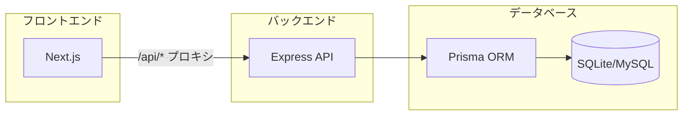
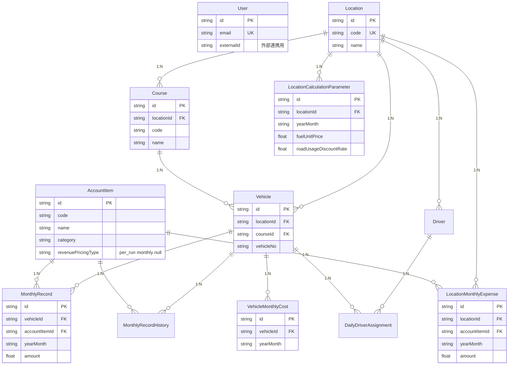

# IZUMI システム概要書

車両別損益計算システム（IZUMI）のエンジニア向けシステム概要です。

---

## 1. システム概要

| 項目 | 内容 |
|------|------|
| システム名 | IZUMI（車両別損益計算システム） |
| 目的 | 約500台の車両×勘定科目×年月ごとの損益データを管理・可視化する |
| 主な利用者 | 事業部、経理財務、現場MG など（権限により制御） |

---

## 2. 技術スタック

| レイヤー | 技術 |
|----------|------|
| フロントエンド | Next.js 14, React 18, Tailwind CSS, Radix UI, Zustand, TanStack Table |
| バックエンド | Express, Prisma |
| データベース | 開発: SQLite / 本番: AWS RDS (MySQL) |
| 認証 | Cookie ベース（httpOnly, secure） |

---

## 3. アーキテクチャ



### プロキシ設定

- `NEXT_PUBLIC_API_URL` 未設定時: `/api/*` を `http://localhost:4000/api/*` へリライト
- `NEXT_PUBLIC_API_URL` 設定時: 指定URLへ直接リクエスト

---

## 4. 主要機能一覧

| 機能 | パス | 説明 |
|------|------|------|
| ルート | / | ダッシュボードへリダイレクト |
| ログイン | /login | ユーザーID または メール・パスワード認証（Cookie ベース） |
| ダッシュボード | /dashboard | 年月・拠点別の売上・原価・粗利益サマリー |
| 車両損益計算書 | /income-statement | 損益データの閲覧・編集・インポート・履歴・Excel出力 |
| 日次連携データ | /daily-summary | 日次集計データの閲覧（ヘッダー非表示） |
| データインポート | /import | CSV/Excel による月次データ一括取込（編集権限者のみ） |
| 連携記録 | /sync-logs | 外部システム連携の成功ログ一覧 |
| 勘定科目マスタ | /account-items | 勘定科目の閲覧・編集（DX/DX管理者のみ） |
| コース・車両マッピング | /course-vehicle-mapping | コースと車両の紐づけ閲覧 |
| コースマスタ | /courses | コースの CRUD（DX/DX管理者のみ、ヘッダー未掲載） |
| ユーザー管理 | /users | ユーザー CRUD・一括同期（DX管理者のみ） |
| アクセス拒否 | /forbidden | 権限不足時の表示ページ |

### 権限による制御

| 権限グループ | 対象ロール | 制御内容 |
|--------------|------------|----------|
| EDIT_PL | 現場MG, 本社MG, 経理財務, 部長, 執行役員, 取締役, DX, DX管理者 | データインポート、損益計算書の編集 |
| MASTER | DX, DX管理者 | 勘定科目・コースの編集、車両・コース sync API |
| USER_ADMIN | DX管理者 | ユーザー管理画面・API |

---

## 5. データモデル

詳細は [db-schema.md](db-schema.md) を参照。



---

## 6. 外部システム連携

| データ | 連携元 | 連携状況 | 備考 |
|--------|--------|----------|------|
| **ユーザー** | イズミクラウド | 対応済み | `userId`（externalId）で連携。`POST /api/users/sync` で一括同期 |
| **車両** | イズミクラウド | 対応済み | `POST /api/vehicles/sync` で一括同期 |
| **コース** | イズミクラウド | 対応済み | `POST /api/courses/sync` で一括同期 |
| **車両・コース** | イズミクラウド | 対応済み | sync で courseId / courseExternalId 指定可能 |
| **ドライバー** | イズミクラウド | 対応済み | `POST /api/drivers/sync`。ATMTC の紐づきを経由 |
| **日次乗務記録** | タイムシート | 対応済み | `POST /api/driver-assignments/sync`、連携後に配賦計算を実行 |
| **ドライバー別月次金額** | タイムシート | 対応済み | `POST /api/driver-monthly-amounts/sync` |
| **日次稼働・走行データ** | タイムシート | 対応済み | `POST /api/daily-operating/sync`（回数/稼働日フラグ。売上日次按分・ドライバー配賦の再計算トリガー） |
| **車両月次費用** | イズミクラウド（ITP含む） | 対応済み | `POST /api/vehicle-monthly-costs/sync`（償却・リース・保険・税＋燃費・道路使用料の生データ） |
| **拠点別月額経費** | PCA（イズミクラウド経由） | 対応済み | `POST /api/location-monthly-expenses/sync`（旅費交通費等・車両数按分） |
| **拠点別計算パラメータ** | 本システム | 対応済み | `PUT /api/location-calculation-parameters`（燃料単価・道路使用料割引率、MASTER 権限） |
| **部門（Department）** | 連携不要 | 本システム内管理 | [department-id-standard.md](department-id-standard.md) 参照 |

### 部門IDの整合性

- 部門データは本システム内で管理し、イズミクラウドと department id で整合
- **標準識別子**: department id（本システム内部では `Location.code` にマッピング）
- 詳細は [department-id-standard.md](department-id-standard.md) を参照

---

## 7. API 一覧

| プレフィックス | 説明 |
|----------------|------|
| `/api/auth` | ログイン・ログアウト |
| `/api/users` | ユーザー CRUD・一括同期（userId/externalId 対応） |
| `/api/dashboard` | ダッシュボードサマリー |
| `/api/daily-summary` | 日次連携データ |
| `/api/daily-operating` | 日次稼働・走行データ sync |
| `/api/drivers` | ドライバー一覧・sync |
| `/api/driver-assignments` | 日次乗務記録 sync |
| `/api/driver-monthly-amounts` | ドライバー別月次金額 sync |
| `/api/income-statement` | 損益計算書データ |
| `/api/account-items` | 勘定科目 |
| `/api/vehicles` | 車両一覧 |
| `/api/locations` | 拠点一覧 |
| `/api/courses` | コース CRUD |
| `/api/import` | データインポート（CSV/Excel） |
| `/api/vehicle-monthly-costs` | POST /sync のみ。車両月次費用の一括 upsert（イズミクラウド/ITP 連携、MASTER）。参照は損益計算書 API が集約 |
| `/api/location-monthly-expenses` | POST /sync のみ。拠点別月額経費の一括 upsert（車両数按分後に MonthlyRecord 更新、MASTER） |
| `/api/location-calculation-parameters` | 拠点別燃料単価・道路使用料割引率の一覧・登録（PUT は MASTER） |
| `/api/arbitrary-insurance` | 任意保険マスタ（トン数別月額）の一覧取得・金額一括更新（PATCH は MASTER） |
| `/api/sync-logs` | 連携記録の取得・登録 |

- データベース定義は [db-schema.md](db-schema.md) を参照
- 部門 ID の運用は [department-id-standard.md](department-id-standard.md) を参照（旧 [location-id-standard.md](location-id-standard.md) は非推奨）
- 残タスクの一覧は [engineering-backlog.md](engineering-backlog.md) を参照
- 車両損益計算書の外部連携の技術仕様は [external-integration-spec.md](external-integration-spec.md) を参照
- 勘定科目ごとの取得・計算ロジックは [account-item-calculation-spec.md](account-item-calculation-spec.md) を参照
- ドライバー配賦 API の詳細は [driver-allocation-api.md](driver-allocation-api.md) を参照

---

## 8. 環境変数

| 変数 | 説明 | 例 |
|------|------|-----|
| `DATABASE_URL` | Prisma 接続文字列 | `file:./dev.db` |
| `NEXT_PUBLIC_API_URL` | API ベース URL（未設定時はリライト） | `http://localhost:4000` |
| `CORS_ORIGIN` | CORS 許可オリジン | `http://localhost:3000` |
| `PORT` | バックエンドポート | `4000` |
| `JWT_SECRET` | JWT 署名用シークレット（本番必須） | ランダム文字列 |

---

## 9. 起動方法

```bash
# フロントエンド（Next.js）
npm run dev

# バックエンド（別ターミナル）
npm run dev:backend

# データベース初期化
cd backend && npm run db:push && npm run db:seed
```

- フロントエンド: http://localhost:3000
- バックエンド: http://localhost:4000
